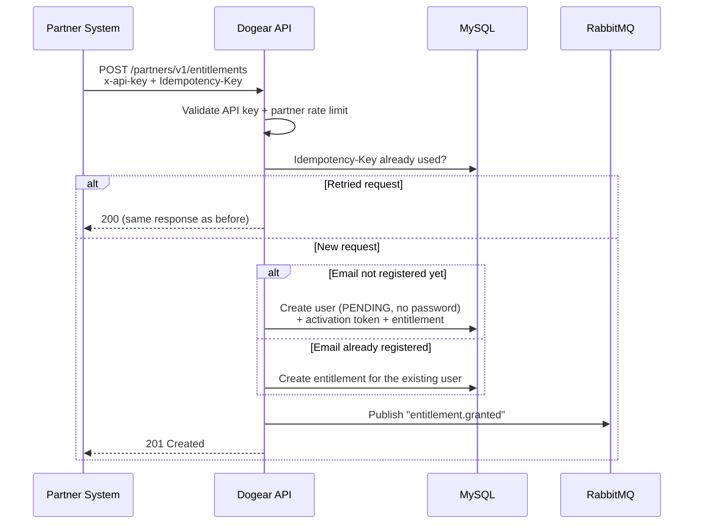
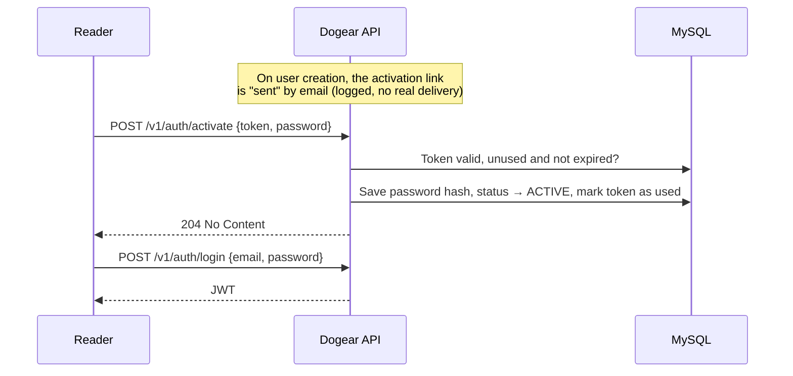
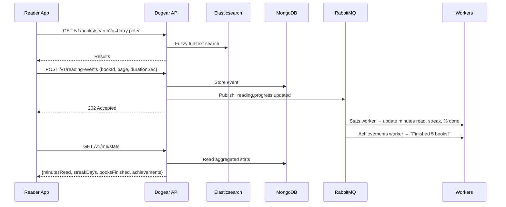
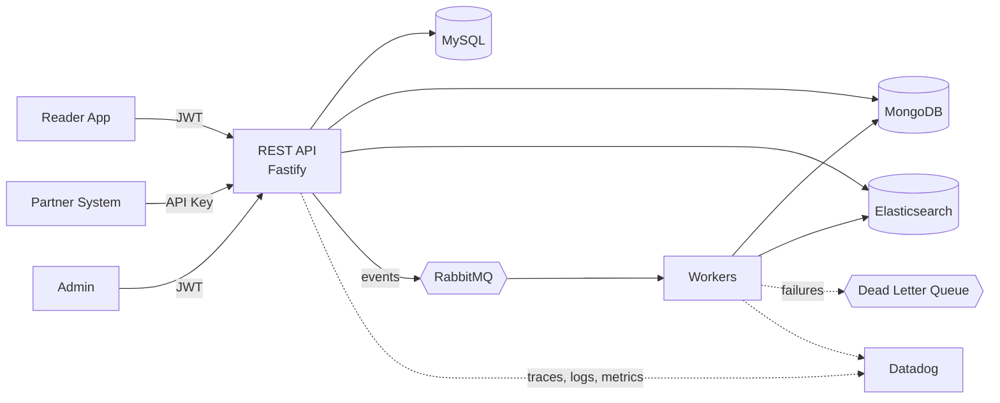

# Dogear — Reading Platform API

> A study project: the backend of a fictional digital reading platform (e-books, audiobooks and minibooks), with a partner API for B2B integrations.

---

## 1. Overview

Dogear serves three kinds of clients:

| Actor       | Auth                  | What they do                                                                             |
| ----------- | --------------------- | ---------------------------------------------------------------------------------------- |
| **Reader**  | JWT                   | Created by a partner, activates the account, then searches, reads and tracks progress    |
| **Partner** | API key (`x-api-key`) | Creates reader accounts, grants and revokes access (e.g. telecom operators, banks)       |
| **Admin**   | JWT (`admin` role)    | Manages the catalog, partners and plans (the first admin is created by a seed)           |

There is **no public sign-up**: every reader account is created by a partner. A reader can only read books while they have at least one active entitlement.

---

## 2. User flows

### 2.1 Partner grants access to a customer

- Retried requests (timeouts, network errors) never create duplicate entitlements.
- The email is the reader's identity: a customer granted access by two partners has one account and two entitlements.
- Partners can revoke access with `DELETE /partners/v1/entitlements/:id`. It takes effect immediately, because access is checked on every request, not stored in the JWT.
- Each partner has a request quota based on its plan (e.g. 60 req/min basic, 600 req/min enterprise).

### 2.2 Reader activates the account

- Users start as `PENDING` and cannot log in until they activate.
- Activation tokens are single-use, expire after 24h and are stored hashed.
- If a token expires, the partner grants access again and a new token is issued.
- Login always fails with a generic `401 Invalid credentials`, so it never reveals which emails exist.

### 2.3 Reader searches, reads and tracks progress

- Search tolerates typos and supports autocomplete and filters (author, genre, format).
- The API responds right away; the heavy processing happens asynchronously in workers.
- Recording reading events requires an active entitlement; otherwise the API returns `403`.

### 2.4 Admin adds a book

The admin creates a book (`POST /v1/admin/books`). It is saved in **MySQL** (the source of truth), a `book.created` event is published, and a worker indexes it in **Elasticsearch**. Failed indexing is retried, then sent to a dead letter queue.

---

## 3. Architecture

The API and workers live in the same repo but run as **separate processes**, so they can scale independently.

### Where data lives

| Data                                                                                         | Store             | Why                                                                 |
| -------------------------------------------------------------------------------------------- | ----------------- | ------------------------------------------------------------------- |
| Users, activation tokens, partners, API keys, plans, entitlements, idempotency keys, catalog | **MySQL**         | Relational, needs transactions and unique constraints               |
| Reading events, reader stats, achievements                                                   | **MongoDB**       | High-volume, append-only, flexible schema (pages vs. audio minutes) |
| Book search index                                                                            | **Elasticsearch** | Full-text, fuzzy matching, autocomplete, faceted filters            |

### Events

| Routing key                                   | Consumers                                           |
| --------------------------------------------- | --------------------------------------------------- |
| `book.created` / `book.updated`               | Search indexer                                      |
| `reading.progress.updated`                    | Stats, Achievements                                 |
| `entitlement.granted` / `entitlement.revoked` | Welcome / access-revoked notification (logged)      |

**Reliability:** topic exchange, manual ack, retry with backoff (5s → 30s → 2min), dead letter queue, and idempotent consumers (each event has an `eventId`).

---

## 4. Tech stack

| Technology                        | Purpose                                           |
| --------------------------------- | ------------------------------------------------- |
| **Node.js + TypeScript**          | Language                                          |
| **Fastify**                       | REST API (workers are plain Node.js processes)    |
| **MySQL 8 + Prisma 7**            | Relational data and migrations                    |
| **MongoDB + Mongoose**            | Reading events and stats                          |
| **RabbitMQ**                      | Async processing, retries, DLQ                    |
| **Elasticsearch 8**               | Catalog search                                    |
| **Datadog** (`dd-trace` + Agent)  | APM, distributed traces, logs, metrics, dashboard |
| **Pino** (built into Fastify)     | Structured JSON logs with correlation ID          |
| **@fastify/swagger** (OpenAPI)    | API docs for v1 and v2                            |
| **@fastify/jwt** + API keys       | Authentication                                    |
| **@fastify/rate-limit**           | Per-partner rate limiting                         |
| **Jest** + Fastify `inject()`     | Unit and e2e tests (no HTTP server needed)        |
| **k6**                            | Load testing                                      |
| **Docker Compose**                | One-command local environment                     |

---

## 5. Main endpoints

| Method   | Route                                    | Description                                    |
| -------- | ---------------------------------------- | ---------------------------------------------- |
| `POST`   | `/v1/auth/activate` · `/v1/auth/login`   | Activate account / get JWT                     |
| `GET`    | `/v1/me`                                 | Current user                                   |
| `GET`    | `/v1/books/search`                       | Search the catalog                             |
| `GET`    | `/v1/books/:id`                          | Book details                                   |
| `POST`   | `/v1/reading-events`                     | Record reading progress                        |
| `GET`    | `/v1/me/library` · `/v1/me/stats`        | Reader's books and stats                       |
| `POST`   | `/partners/v1/entitlements`              | Grant access (idempotent)                      |
| `DELETE` | `/partners/v1/entitlements/:id`          | Revoke access                                  |
| `GET`    | `/partners/v1/usage`                     | Partner quota usage                            |
| `POST`   | `/v1/admin/books` · `/v1/admin/partners` | Manage catalog and partners                    |
| `POST`   | `/v1/admin/partners/:id/api-keys`        | Issue a partner API key                        |
| `GET`    | `/v2/books/search`                       | Cursor-based pagination (v1 marked deprecated) |
| `GET`    | `/health` · `/docs`                      | Health check · Swagger UI                      |

---

## 6. Non-functional requirements

- **Security:** hashed passwords and API keys (keys shown only once), role-based authorization hooks, per-partner rate limiting, input validation.
- **Observability:** `x-correlation-id` propagated from HTTP through RabbitMQ into logs and traces; custom metrics (events/min, DLQ size, search latency); Datadog dashboard.
- **Reliability:** idempotent endpoints and consumers, retries + DLQ, health checks for every dependency.
- **Quality:** unit tests for business rules, e2e tests for main flows, ESLint + Prettier.

---

## 7. Five-day plan

| Day   | Deliverables                                                                          |
| ----- | ------------------------------------------------------------------------------------- |
| **1** | Docker Compose, Fastify setup, config, Swagger, user model, admin seed, login + roles |
| **2** | Catalog, partners and API keys, idempotent entitlements, activation, rate limiting    |
| **3** | Reading events (MongoDB), RabbitMQ publishers and workers, retry and DLQ              |
| **4** | Elasticsearch indexing and search, Datadog tracing, logs and dashboard                |
| **5** | `/v2` endpoint, tests, k6 load test, seed data, README                                |

---

## 8. Out of scope

E-book reader or audio player (reading is simulated through events), file uploads, payments, real email delivery, front-end and cloud deployment.
